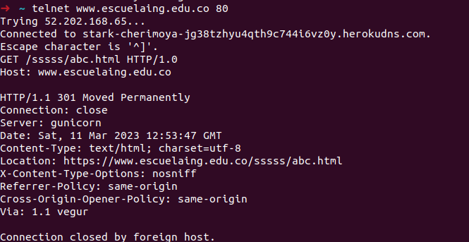
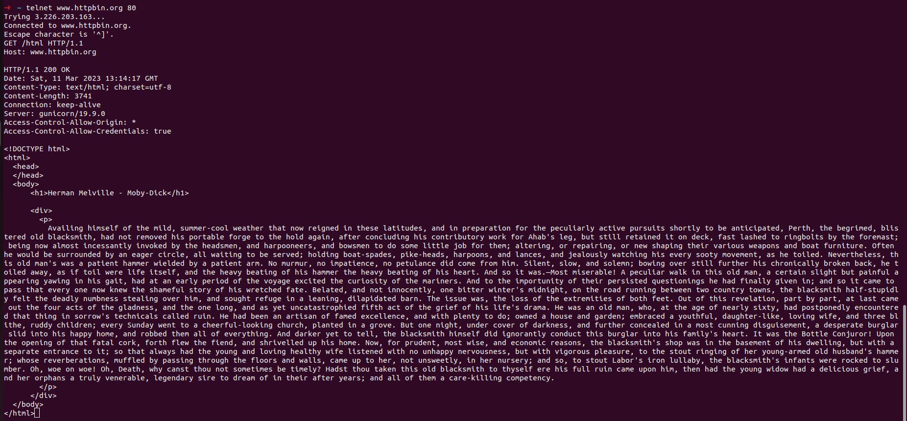
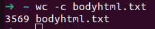

# CVDS - LABORATORIO 5 - INTRODUCCIÓN A PROYECTOS WEB

## INTEGRANTES

Angie Natalia Mojica - Daniel Antonio Santanilla

## RESPUESTAS

### Parte I

1. Abra una terminal Linux o consola de comando Windows
2. Realice una conexión síncronica TCP/IP a través de Telnet al siguiente servidor
   - Host: www.escuelaing.edu.co
   - Puerto: 80

   ```bash
   telnet www.escuelaing.edu.co 80
   ```

3. Revisar el resultado obtenido solicitando el recurso `/sssss/abc.html` usando la version 1.0 de HTTP
    
    - ¿Qué código de error sale?\
       El código de error que sale es 301 Moved Permanetly
    - ¿Qué otros códigos de error existen? ¿En qué casos se manejarán?
       1. 1xx Informational response\
          Indica que la solicitud fue recibida y atendida.
       2. 2xx Success\
          Indica que la solicitud fue recibida por el cliente fue recibida, entendida y aceptada.
       3. 3xx Redirection\
          Indica que el cliente debe realizar una acción adicional para completar la solicitud.
       4. 4xx Client errors\
          Indica las situaciones en las que el error parece haber sido causado por el cliente.
       5. 5xx Server errors\
          Indica que el servidor no pudo cumplir con una solicitud.
       [Códigos de estado HTTP](https://en.wikipedia.org/wiki/List_of_HTTP_status_codes)
4. Realice una nueva conexión telnet y solicite el recurso  `/html`, esta vez a:
   - Host: www.httpbin.org
   - Puerto: 80
   - Versión HTTP/1.1
   
5. Seleccione elcontenido HTML de la respuesta y copielo al portapapeles `CTRL-SHIFT-C`. Ejecute elcomando `wc` (word count) para contar palabras con la
opción `-c` para contar el número de caracteres:

   ```bash
   wc -c bodyhtml.txt
   ```

   
   ¿Cuál es la diferencia entre los verbos GET y POST? ¿Qué otros tipos de peticiones existen?
   - **GET** se utiliza para solicitar datos de un recurso específico a un servidor web.
   - **POST** se utiliza para enviar datos a un servidor web para procesarlos, se utiliza comúnmente para enviar información confidencial o datos que son demasiado largos para ser enviados a través del método GET.
   - **Otras peticiones**
      - **PUT**
         Se utiliza para actualizar un recurso existente en un servidor web con un nuevo conjunto de datos.
      - **DELETE**
         Se utiliza para eliminar un recurso existente en un servidor web.
      - **HEAD**
         Se utiliza para solicitar sólo la información de encabezado de una respuesta HTTP, sin incluir el cuerpo del mensaje.
      - **OPTIONS**
         Se utiliza para obtener información sobre los métodos HTTP que son compatibles con un recurso en particular en un servidor web.
      - **PATCH**
         Se utiliza para actualizar parcialmente un recurso en un servidor web con un conjunto específico de cambios.
      - **TRACE**
         Se utiliza para obtener una respuesta de retorno de un mensaje que incluye la secuencia de cambios realizados por cualquier servidor intermedio en el camino entre el cliente y el servidor final.
6. En la practica no se utiliza  `telnet` para hacer peticiones a sitios web sino el comando `curl` con ayuda de la linea de comandos: `curl www.httpbin.org`, utilice el parámetro `-v`y el parámetro `-i`
   
   
   ¿Cuáles son las difernecias con los diferentes parámetros?
