# CVDS - LABORATORIO 5 - INTRODUCCIÓN A PROYECTOS WEB

## INTEGRANTES

Angie Natalia Mojica - Daniel Antonio Santanilla

## RESPUESTAS

### Parte I - JUGANDO A SER UN CLIENTE HTTP

1. Abra una terminal Linux o consola de comando Windows
2. Realice una conexión síncronica TCP/IP a través de Telnet al siguiente servidor
    - Host: www.escuelaing.edu.co
    - Puerto: 80

    ```bash
    telnet www.escuelaing.edu.co 80
    ```

3. Revisar el resultado obtenido solicitando el recurso `/sssss/abc.html` usando la version 1.0 de HTTP
        
        - ¿Qué código de error sale?\
        El código de error que sale es 301 Moved Permanetly
        - ¿Qué otros códigos de error existen? ¿En qué casos se manejarán?
        1. 1xx Informational response\
            Indica que la solicitud fue recibida y atendida.
        2. 2xx Success\
            Indica que la solicitud fue recibida por el cliente fue recibida, entendida y aceptada.
        3. 3xx Redirection\
            Indica que el cliente debe realizar una acción adicional para completar la solicitud.
        4. 4xx Client errors\
            Indica las situaciones en las que el error parece haber sido causado por el cliente.
        5. 5xx Server errors\
            Indica que el servidor no pudo cumplir con una solicitud.
        [Códigos de estado HTTP](https://en.wikipedia.org/wiki/List_of_HTTP_status_codes)
4. Realice una nueva conexión telnet y solicite el recurso  `/html`, esta vez a:
    - Host: www.httpbin.org
    - Puerto: 80
    - Versión HTTP/1.1
    
5. Seleccione elcontenido HTML de la respuesta y copielo al portapapeles `CTRL-SHIFT-C`. Ejecute elcomando `wc` (word count) para contar palabras con la
opción `-c` para contar el número de caracteres:

    ```bash
    wc -c bodyhtml.txt
    ```

    \
    ¿Cuál es la diferencia entre los verbos GET y POST? ¿Qué otros tipos de peticiones existen?
    - **GET** se utiliza para solicitar datos de un recurso específico a un servidor web.
    - **POST** se utiliza para enviar datos a un servidor web para procesarlos, se utiliza comúnmente para enviar información confidencial o datos que son demasiado largos para ser enviados a través del método GET.
    - **Otras peticiones**
        - **PUT**
            Se utiliza para actualizar un recurso existente en un servidor web con un nuevo conjunto de datos.
        - **DELETE**
            Se utiliza para eliminar un recurso existente en un servidor web.
        - **HEAD**
            Se utiliza para solicitar sólo la información de encabezado de una respuesta HTTP, sin incluir el cuerpo del mensaje.
        - **OPTIONS**
            Se utiliza para obtener información sobre los métodos HTTP que son compatibles con un recurso en particular en un servidor web.
        - **PATCH**
            Se utiliza para actualizar parcialmente un recurso en un servidor web con un conjunto específico de cambios.
        - **TRACE**
            Se utiliza para obtener una respuesta de retorno de un mensaje que incluye la secuencia de cambios realizados por cualquier servidor intermedio en el camino entre el cliente y el servidor final.
6. En la practica no se utiliza  `telnet` para hacer peticiones a sitios web sino el comando `curl` con ayuda de la linea de comandos: `curl www.httpbin.org`, utilice el parámetro `-v`y el parámetro `-i`\
    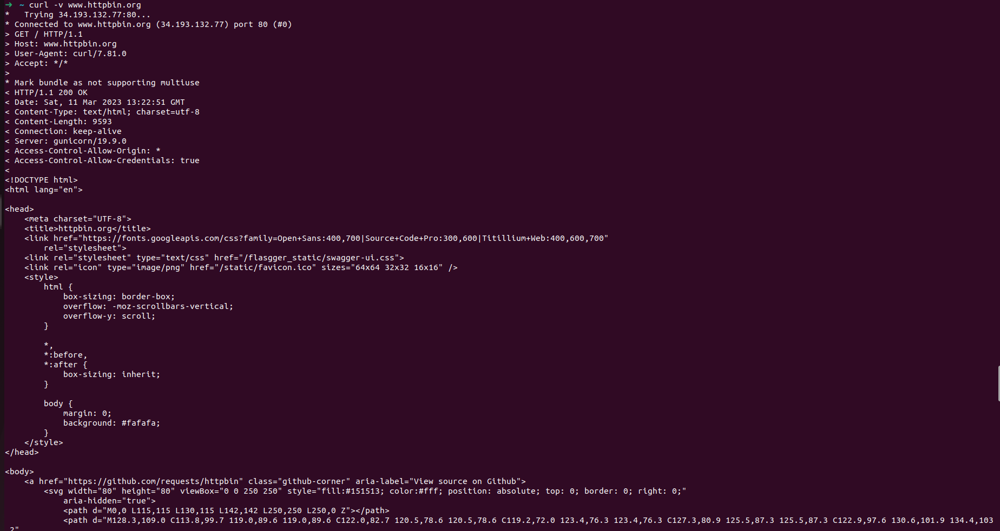\
    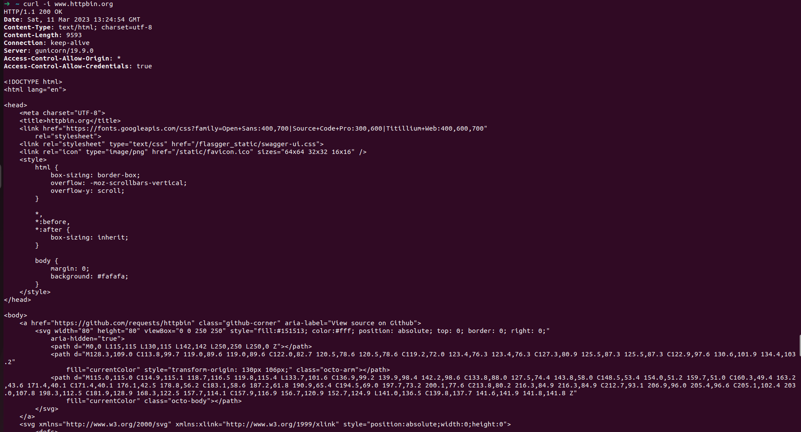
    ¿Cuáles son las difernecias con los diferentes parámetros?
    - **VERBOSE (-v):**
    Indica la información detallada sobre la comunicación que se está llevando a cabo entre el cliente y el servidor.
    - **INCLUDE (-i):**
    Incluye los encabezados de respuesta en la salida, además del cuerpo de la respuesta, es útil para asegurar que todo este funcionando correctamente.

### Parte II - JUGANDO A SER UN CLIENTE HTTP

Cree un proyecto maven nuevo usando el arquetipo de aplicación Web estándar `maven-archetype-webapp` y realice lo que se encuentra en la guía de laboratorio:

01. Revise la clase SampleServlet incluida a continuacion, e identifique qué hace:

    ```bash
    mvn archetype:generate
    ```

02. En el pom.xml, modifique la propiedad "packaging"con el valor "war". Agregue la siguiente dependencia:

    ```xml
    <packaging>war</packaging>
    <dependency>
      <groupId>javax</groupId>
      <artifactId>javaee-web-api</artifactId>
      <version>7.0</version>
      <scope>provided</scope>
    </dependency>
    ```

03. Revise en el pom.xml para qué puerto TCP/IP está configurado elservidor embebido de Tomcat (versección de plugins).

    El puerto esta configurado para que use el 8080

    ```xml
    <plugin>
      <groupId>org.apache.tomcat.maven</groupId>
      <artifactId>tomcat7-maven-plugin</artifactId>
      <version>2.2</version>
      <configuration>
        <port>8080</port>
        <path>/</path>
      </configuration>
    </plugin>
    ```

04. Compile y ejecute la aplicación en elservidor embebido Tomcat, a través de Maven con:

    ```bash
    mvn package
    mvn tomcat7:run
    ```

05. Abra un navegador, y en la barra de direcciones ponga la URL con la cualse le enviarán peticiones al ‘SampleServlet’. Tenga en cuenta que la URL tendrá como host ‘localhost’, como puerto, elconfigurado en el pom.xml y el path debe ser el del Servlet. Debería obtener un mensaje de saludo.

    En el navegador poner lo siguiente `localhost:8080/helloServlet`\
    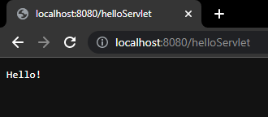

06. Observe que el Servlet ‘SampleServlet’ acepta peticiones GET, y opcionalmente, lee el parámetro ‘name’. Ingrese la misma URL, pero ahora agregando un parámetro GET (si no sabe como hacerlo, revise la documentación en [](http://www.w3schools.com/tags/ref_httpmethods.asp).

    En el navegador ponemos lo siguiente `http://localhost:8080/helloServlet?name=%20AngieDaniel`\
    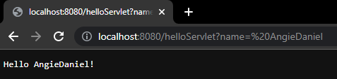

07. Busque el artefacto `gson` en el repositorio de maven y agregue la dependencia.

    Agregamos al `pom.xml` la dependencia `gson`

    ```xml
    <!-- https://mvnrepository.com/artifact/com.google.code.gson/gson -->
    <dependency>
      <groupId>com.google.code.gson</groupId>
      <artifactId>gson</artifactId>
      <version>2.10</version>
    </dependency>
    ```

08. En el navegador revise la dirección [](https://jsonplaceholder.typicode.com/todos/1). Intente cambiando diferentes números al final del path de la url.

    Consultamos los números 1 y 200\
    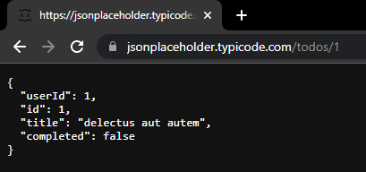\
    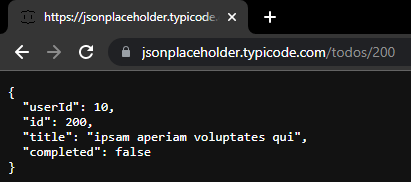

09. Basado en la respuesta que le da elservicio del punto anterior,cree la clase edu.eci.cvds.servlet.model.Todo con un constructor vacío y los métodos getter y setter para las propiedades de los "To Dos" que se encuentran en la url indicada.

    Se crea la clase `Todo` como se indica en la guía de laboratorio en el paquete `edu.eci.cvds.servlet.model`

10. Utilice la siguiente clase para construir el servicio que se encuentra en la dirección url del punto anterior.

    Se crea la clase `Service` como se indica en la guía de laboratorio en el paquete `edu.eci.cvds.servlet`

11. Cree una clase que herede de la clase HttpServlet (similar a SampleServlet), y para la misma sobrescriba el método heredado doGet. Incluya la anotación `@Override` para verificar –en tiempo de compilación- que efectivamente se esté sobreescribiendo un método de lassuperclases.

    Se crea la clase `Servlet` como se indica en la guía de laboratorio en el paquete `edu.eci.cvds.servlet`

12. Para indicar en qué URL el servlet interceptará las peticiones GET, agregue al método la anotación `` @WebServlet`, y en dicha anotación, defina la propiedad urlPatterns, indicando la URL (que usted defina) a la cualse asociará elservlet.

    En la clase `Servlet` indicamos la URL

    ```java
    @WebServlet(
        urlPatterns = "/AngieDanielServlet"
    )
    ```

13. Teniendo en cuenta los siguientes métodos disponibles en los objetos ServletRequest y ServletResponse recibidos por el método doGet:

    Crear el método como se indica en la guía de laboratorio.

14. Una vez hecho esto, verifique el funcionamiento de la aplicación, recompile y ejecute la aplicación.

    ```bash
    mvn package
    mvn tomcat7:run
    ```

15. Intente hacer diferentesconsultas desde un navegador Web para probar las diferentesfuncionalidades.

    Consultando cuando el item existe\
    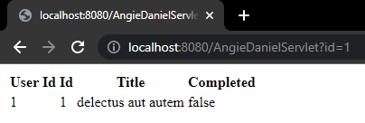

    Consultando cuando el item no es un entero\
    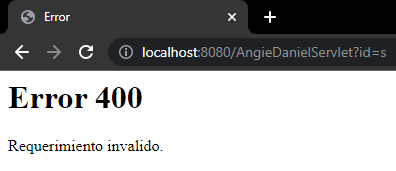

    Consultando cuando el item no existe\
    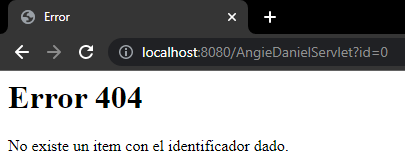

    Consultando cuando no se indicaron parámetros\
    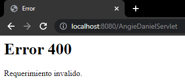

### Parte III - CONTINUACION

1. En su servlet,sobreescriba el método doPost, y haga la misma implementación del doGet.

    Se sobreescribe el método `doPost` con la misma implementación que `doGet` en la clase `Servlet`

2. Cree el archivo index.html en el directorio src/main/webapp/index.html de la siguiente manera:

    Se crea el archivo `index.html` en el directorio `src/main/webapp/`

3. En la página anterior, cree un formulario que tenga un campo para ingresar un número (si no ha manejado html antes, revise [](http://www.w3schools.com/html/)) y un botón. El formulario debe usar como método ‘POST’, y como acción, la ruta relativa del último servlet creado (es decir la URL pero excluyendo ‘<http://localhost:8080/>’).

    ```html
    <form method="POST" action="AngieDanielServlet">
      <label for="id">Ingresa el número de ID:</label>
      <input type="number" id="id" name="id" required>
      <button type="submit" onclick="myFunction()">Enviar</button>
    </form>
    ```

4. Revise este [ejemplo de validación de formularios con javascript](https://www.w3schools.com/js/js_validation.asp) y agruéguelo a su formulario, de manera que -al momento de hacer ‘submit’- desde el browser se valide que el valor ingresado es un valor numérico.

    ```javascript
    function myFunction() {
        var id = document.getElementById("id").value;
        if (isNaN(id)) {
            alert("El valor ingresado no es un numero");
        }
    }
    ```

5. Recompile y ejecute la aplicación. Abra en su navegador en la página del formulario, y rectifique que la página hecha anteriormente sea mostrada. Ingrese los datos y verifique losresultados. Cambie el formulario para que ahora en lugar de POST, use el método GET . Qué diferencia observa?

    Formulario\
    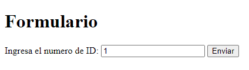

    Ingresando los datos con el formulario en POST\
    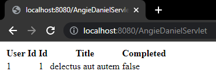

    Ingresando los datos con el formulario en GET\
    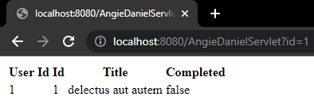

    La diferencia que se observa es en la visualizacion de la url, usando GET indica el parámetro que fue enviado y en POST no indica ningún parámetro y la consulta es la misma.

6. ¿Qué se está viendo? Revise cómo están implementados los métodos de la clase Service.java para entender el funcionamiento interno.

    Se muestra una tabla con información de una tarea específica que se selecciona mediante un formulario que solicita una ID. La tabla se crea utilizando la clase Service, que obtiene la información de la tarea mediante el método `getTodo(int id)`. Luego, se utiliza el método `todosToHTMLTable(List todoList)` para crear la tabla a partir de una lista de tareas.

### PARTE IV. - FRAMEWORKS WEB MVC – JAVA SERVER FACES / PRIME FACES

En este ejercicio, usted va a desarrollar una aplicación Web basada en el marco JSF, y en una de susimplementaciones más usadas: PrimeFaces. Se trata de un juego en línea para adivinar un número, en el que el ganador,si atina en la primera oportunidad, recibe $100.000. Luego, porcada intento fallido, el premio se reduce en $10.000.

1. Al proyecto Maven, debe agregarle las dependencias mas recientes de `javax.javaee-api`, `com.sun.faces.jsf-api`, `com.sun.faces.jsf-impl`, `javax.servlet.jstl` y `Primefaces` (en el archivo `pom.xml`).

   ```xml
   <!-- https://mvnrepository.com/artifact/javax/javaee-api -->
   <dependency>
      <groupId>javax</groupId>
      <artifactId>javaee-api</artifactId>
      <version>8.0.1</version>
      <scope>provided</scope>
   </dependency>
   <!-- https://mvnrepository.com/artifact/com.sun.faces/jsf-api -->
   <dependency>
      <groupId>com.sun.faces</groupId>
      <artifactId>jsf-api</artifactId>
      <version>2.2.20</version>
   </dependency>
   <!-- https://mvnrepository.com/artifact/com.sun.faces/jsf-impl -->
   <dependency>
      <groupId>com.sun.faces</groupId>
      <artifactId>jsf-impl</artifactId>
      <version>2.2.20</version>
   </dependency>
   <!-- https://mvnrepository.com/artifact/javax.servlet/jstl -->
   <dependency>
      <groupId>javax.servlet</groupId>
      <artifactId>jstl</artifactId>
      <version>1.2</version>
   </dependency>
   <!-- https://mvnrepository.com/artifact/org.primefaces/primefaces -->
   <dependency>
      <groupId>org.primefaces</groupId>
      <artifactId>primefaces</artifactId>
      <version>12.0.0</version>
   </dependency>
   ```

2. Para que configure automáticamente el descriptor de despliegue de la aplicación (archivo `web.xml`), de manera que el framework JSF se active al inicio de la aplicación, en el archivo `web.xml` agregue la siguiente configuración:

   ```xml
   <servlet>
      <servlet-name>Faces Servlet</servlet-name>
      <servlet-class>javax.faces.webapp.FacesServlet</servlet-class>
      <load-on-startup>1</load-on-startup>
   </servlet>
   <servlet-mapping>
      <servlet-name>Faces Servlet</servlet-name>
      <url-pattern>/faces/*</url-pattern>
   </servlet-mapping>
   <welcome-file-list>
      <welcome-file>faces/index.jsp</welcome-file>
   </welcome-file-list>
   ```

3. Revise cada una de lasconfiguraciones agregadas anteriormente para saber qué hacen y por qué se necesitan. Elimine las que no se necesiten.

4. Ahora, va a crear un Backing-Bean de sesión, el cual, para cada usuario, mantendrá de lado del servidor las siguientes propiedades:
   a. El número que actualmente debe adivinar (debe ser un número aleatorio).
   b. El número de intentosrealizados.
   c. El premio acumulado hasta el momento.
   d. El estado del juego, que sería una cadena de texto que indica si ya ganó o no, y si ganó de cuanto es el premio.
